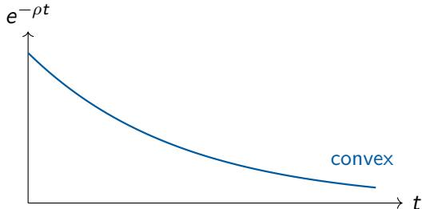
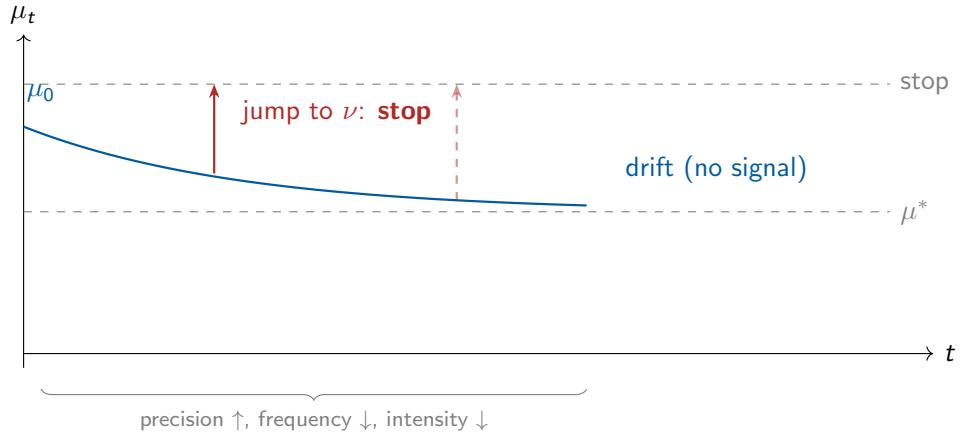

## What should you learn, and when should you stop? {.emphasis-slide}
### Motivation

::::: {.columns}
:::: {.column width="40%"}

- An **Expected Utility Maximizer** decision-maker must choose an action $a \in A$. 
- Her payoff depends on an unknown state $x \in X$. 
- She can design any experiment she likes, at each instant in time. 
::::
:::: {.column width="60%"}
::: {.fragment}
- **Learning takes time**
  - Delayed payoffs are discounted at rate $\rho > 0.$
:::
::: {.fragment}
- **Learning is costly**
  - Faster learning costs more (convex cost).
:::
::: {.fragment}
- She chooses what to learn and when to stop. 
  - **Complete flexibility over information**
:::
::::
:::::

::: {.fragment}
[If you have complete **flexibility over information,** what does optimal learning
look like?]{.bg}
:::

# Model {.section-slide}

## Environment

### Information
- **Belief-based approach:** She chooses belief process $\langle \mu_t \rangle \in \Delta (X)$ nonparametrically. 
- **Bayes' rule:** $\mathbb{E}[\mu_{s}\mid \mathcal{F}_{t}] = \mu_{t}\; \forall s > t$
  - $\langle \mu_t \rangle$ is a **martingale**, with $\langle \mathcal{F}_t \rangle$ beings its natural filtration. 

::: {.fragment}
- **Informativeness:** Speed at which uncertainty falls when belief updates. 
  - $I_{t} = -\mathcal{A}_{t}H$, where $H$ is strictly concave. 
  - $H$ is a measure of uncertainty [@frankelQuantifyingInformationUncertainty2019].
:::

::: {.fragment}
- **Cost of information:** Weakly increasing and convex in informativeness. $C'(\infty) = \infty$
  - $C(I_t)$ satisfies **Uniformly Posterior-Separability** properties, and **path independence. (Theorem 3)**
:::

## Problem

### Stochastic Control Problem
$$
V (\mu) = \sup  _ {\left\langle \mu_ {t} \right\rangle \in \mathbb {M}, \tau} E \left[ e ^ {- \rho \tau} F \left(\mu_ {\tau}\right) - \int_ {0} ^ {\tau} e ^ {- \rho t} C \left(I _ {t}\right) d t \right]
$$

- $F(\nu) \triangleq \max_{a \in A} E_{\nu}[u(a, x)]$ for all beliefs $\nu \in \Delta(X)$

::: {.fragment}
### Hamilton-Jacobi-Bellman Variational Inequality

$$
\rho V(\mu_{t}) = \max  \left\{\underbrace{\rho F \left(\mu_ {t}\right)} _ {\text{stopping value}}, \sup  _ {\mathrm {d} \mu_ {t}} \left\{\underbrace {\mathcal {A} _ {t} V}_{\text {continuation value}} - \underbrace {C \left(- \mathcal {A} _ {t} H\right)}_{\text {control cost}} \right\} \right\}
$$

[$C$ is convex $\implies$ must spread learning overtime. How?]{.bg}

:::

# Characterization of Optimal Learning {.section-slide}

## The optimal belief process is a compensated Poisson process.

### DM waits for a rare “breakthrough”

- **With small probability $p dt$:** belief jumps to target $\nu ( \mu )$
  - Stop immediately.   
- **With probability $1 - p d t$:** no breakthrough 
  - Belief drifts (bad news from silence).

::: {.fragment}

### Characteristics of the breakthrough

- **Confirmatory**:
 - it pushes the belief toward the most likely state.   
- Over time, rarer but more decisive:
  - Gaussian learning (continuous, diffusive) is generically suboptimal.

:::

## Why Poisson? 
### Because the DM is time-risk loving [@dejarnetteTimeLotteriesStochastic2020]

- The DM’s strategy induces a distribution over stopping times $\tau$ .
- Under exponential discounting, the "utility of stopping at time $t$" is $e ^ { - \rho t }$.
- **Jensen's inequality:** convex utility $\Rightarrow$ the DM prefers more dispersed stopping times.

{scale=2}

- **Poisson:** Maximally dispersed $\tau$
  - Either stop very soon, or wait a very long time.
- **Gaussian** Hump-shaped $\tau$
  - Typically stop around the mean time. 
  - Bad for time-risk lovers.

## Only Poisson $+$ Gaussian can be optimal
### Theorem 1

- The DM could choose any martingale (jumps of all sizes, diffusion, etc.). 
- Theorem 1 says it suffices to consider:

$$
d \mu_ {t} = \left(\nu - \mu_ {t}\right) \left(d J _ {t} (p) - p d t\right) + \sigma d W _ {t}
$$

#### At each instant, the DM chooses a distribution $\pi$ of next-period beliefs.

- Benefit $\mathbb { E } _ { \pi } [ V ( \nu ) ]$ and information $\mathbb { E } _ { \pi } [ H ( \mu ) - H ( \nu ) ]$ are both linear in $\pi$ .   
  - Solution has finite support (Carathéodory).   
- The UPS cost structure makes information a scalar. 
- Consider infinite-dimensional control to three parameters $( p , \nu , \sigma )$ .

## Theorem 2: the five properties (binary state, $\mu \in \{0, 1\}$)

Let $\mu^* = \arg\min V$ and $E = \{ \mu : V ( \mu ) > F ( \mu ) \}$ be the experimentation region.

1.  Poisson $\succ$ Gaussian. Gaussian is strictly suboptimal everywhere in $E$ (except possibly at $\mu^{*}$ ).   
2. Confirmatory. $\mu > \mu ^ { * } \Rightarrow \nu ( \mu ) > \mu$ . The signal pushes belief away from $\mu ^ { * }$   
3.  Increasing precision. As $\mu \to \mu ^ { * }$ (less certain), the jump $| \nu ( \mu ) - \mu ^ { * } |$  increases.   
4.  Decreasing frequency. Flow information $I ( \mu )$ is increasing in $V ( \mu )$ , so $I$ falls as $\mu \to \mu ^ { * }$ .   
5. Immediate stopping. $\nu ( \mu )$ is in the stopping region. The DM acts the instant the signal arrives.

## 

# References {.section-slide}

## References 

::: {#refs}
:::
